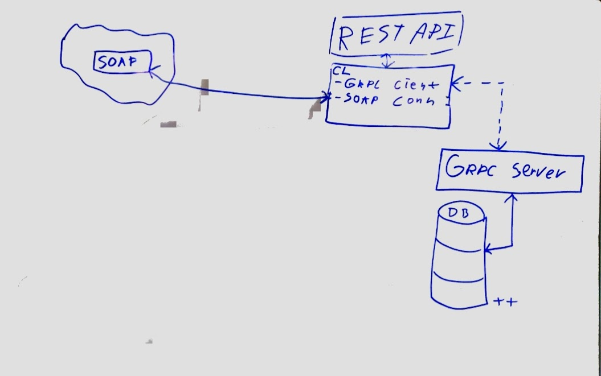

# Mini Project 1

## How to run
```
docker-compose up
```

## The team

Developed by Andreas Zoega Vesterborg Vikke, Asger Hermind Sørensen, Martin Eli Frederiksen og William Sehested Huusfeldt. 

## Solution specifications
- Database: mssql
- gRPC services: BookService, StudentService, CourseService, RoomService
- SOAP services: ISBNService
- WebAPI: RESTful

For our solution we've used gRPC services to communicate with our database. For validation of we're using ISBN to call a remote SOAP service. Lastly we've used RESTful as our WebAPI with custom endpoints.

### Project architecture



## WebAPI & endpoints: 

base curl url: ```http://localhost:8000```

swagger: ```http://localhost:8000/swagger/index.html```

## student:

add student: ```/students/add```

get all students: ```/students/get/all```

get student by id: ```/students/get/{id}```


## Course: 
add course: ``` /course/add ```

get all courses: ``` /course/get/all ```

get courses by  id: ``` /course/get/{id} ```

## Book

Note: when adding a book, make sure you're using a valid ISBN number, or else you'll get an error. 

add book: ``` /book/add ``` 

get all books: ``` /book/get/all ```

get books by  id: ``` /book/get/{id} ```

## ISBN 

Validate ISBN10: ``` /ISBNValidator/10/{isbn} ```

Validate ISBN13: ``` /ISBNValidator/13/{isbn} ```


