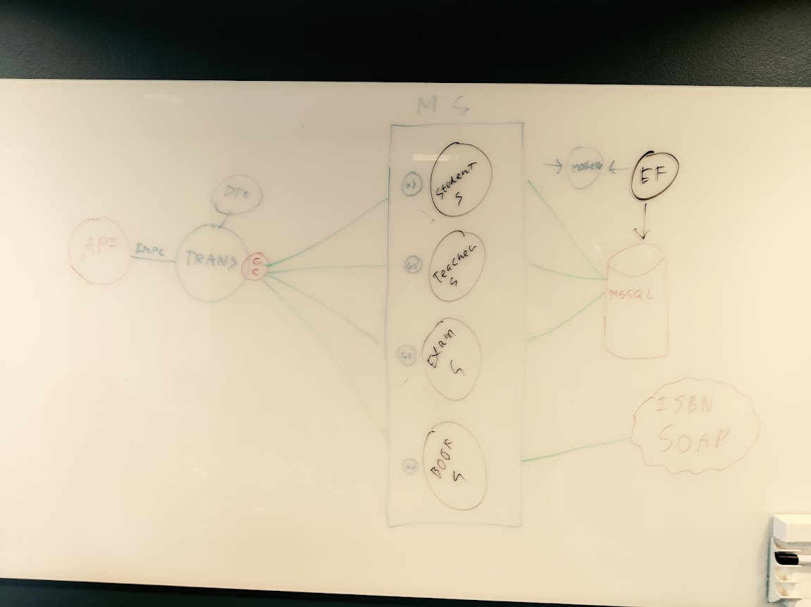

# Mini Project 2

## How to run
```
docker-compose up
(Will take some time, be patient)
```

## The team

Developed by Andreas Zoega Vesterborg Vikke, Asger Hermind Sørensen, Martin Eli Frederiksen og William Sehested Huusfeldt. 


### Project architecture



## WebAPI & endpoints: 

Base curl url: [http://localhost:8000](http://localhost:8000)

Swagger: [http://localhost:8000/swagger/index.html](http://localhost:8000/swagger/index.html)
