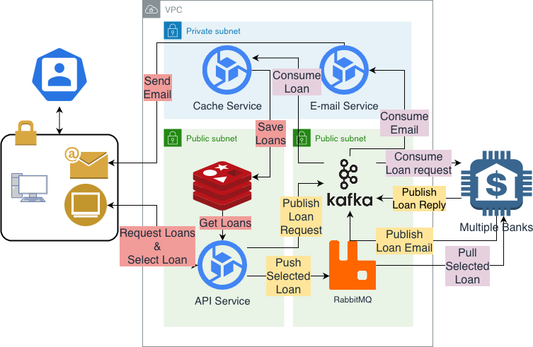

# Mini Project 3

# Table of Contents
  - [How to run](#how-to-run)
  - [The team](#the-team)
  - [Assignment](#assignment)
    - [Objective](#objective)
    - [Task](#task)
  - [Introduction](#introduction)
  - [Project Achitecture](#project-achitecture)
  - [API & endpoints](#api--endpoints)
    - [Request loan](#request-loan)
    - [Select loan](#select-loan)
    - [Get loan](#get-loan)

## How to run 
```
docker-compose up
```
This command will take some time to complete, be patient. Wait at least 2 mins

Goto: [http://localhost](http://localhost)

## The team

Developed by Andreas Zoega Vesterborg Vikke, Asger Hermind Sørensen, Martin Eli Frederiksen og William Sehested Huusfeldt. 

## Assignment
### Objective
The main objective of this assignment is to provide the students with practical
experience in creating and integrating small-scale enterprise application implementing
message-oriented middleware.

### Task
Create MOM-integrated bank application, which enables the following services:
- a customer makes a loan requests to multiple banks;
- some of the requested banks respond to the customer with loan quotes;
- customer compares the quotes and selects one, based on own financial criteria;
- customer applies for the selected bank product, sending her/his personal data;
- bank returns a confirmation letter to the customer (text file) and a copy of a contract (file);
- the confirmation letter starts with the salutation “Dear XX NN,”, where:
    * XX is either ‘Mr’, ‘Ms’, or ‘Mx’, depending on the specified or non-specified gender
    of the receiver;
    * NN is the name of the receiver.  
- the gender of the receiver can be retrieved out of the name by use of a web service,
hosted at [http://www.thomas-bayer.com/restnames/](http://www.thomas-bayer.com/restnames/)

## Introduction

**Warning!** The email service will **not** work unless you provide it with the password, which you set through the environment variable in the docker-compose.yaml file. The password is supplied on peergrade to give reviewers access to the email. Simply replace the comment with the password, and the email service will work. Be aware that on most email servers the confirmation letter will be flagged as scam, so be sure to check your spam folder for this email. 

We've split the assignment down into microservices that are written in python, and written the api in Go. 


## Project Achitecture



## API & endpoints

base url: [http://localhost:90](http://localhost:90)

### Request loan
`/loan/request/:userId`

#### example body
```
{
    "amount" : 10000,
    "startMonth": 1,
    "endMonth": 4
}   
``` 

### Select loan
``/loan/select/:userId``

#### example body
```
{
    "uuid" : 123,
    "userId": "89746521",
    "bankId": "2",
    "cpr": 123,
    "loanId": "6598437623",
    "amount": 10000,
    "monthToPay": 12,
    "interest": 5.2,
    "AOP": 99,
    "email": "your@email.com",
    "name": "Kim"
}  
``` 

Note that supplying a name that is not in [http://www.thomas-bayer.com/restnames/](http://www.thomas-bayer.com/restnames/) will throw an error.

### Get loan
``/loan/get/:userId``